# Hangman

## Code Institute - Thired Milestone Project: Python Essentials Portfolio Project

## Overview
This program is a computerized version of the original hangman game, based inside a mock terminal deployed via Heroku.

As a child, I enjoyed the Hangman game a lot during my school days. It is popular as an educational tool to reinforce vocabulary and spelling skills.

Hangman is a classic word-guessing game in which one player thinks of a word and the other player tries to guess it by suggesting letters. The word is represented by dashes, with each dash representing a letter in the word. The player guessing the word suggests letters one at a time, and if the guessed letter is in the word, the other player reveals all occurrences of that letter in the word. If the guessed letter is not in the word, a part of a stick figure (traditionally a gallows) is drawn as a tally of incorrect guesses.

The game continues until the guessing player successfully guesses the word or the stick figure is completely drawn (indicating too many incorrect guesses), resulting in a loss. The stick figure drawing often resembles a hanging person, which is why the game is called "Hangman."

# Table of Contents
- [Demo](#demo)
  - [A live demo to the website can be found here](#a-live-demo-to-the-website-can-be-found-here)
- [How to Play:](#how-to-play)
- [Planning Phase](#planning-phase)
  - [User stories:](#user-stories)
  - [Site Aims:](#site-aims)
  - [How Will This Be Achieved:](#how-will-this-be-achieved)
  - [Game Flow Chart:](#game-flow-chart)
- [Features](#features)
  - [Welcome Screen:](#welcome-screen)
  - [Once Play Game is Started:](#once-play-game-is-started)
  - [Error Handling:](#error-handling)
  - [Future-Enhancements:](#future-enhancements) 
- [Data Model](#testing)
- [Testing](#testing)
  - [Validator Testing](#validator-testing)
  - [Bugs](#bugs)
- [Libraries](#libraries)
  - [random:](#random)
  - [tkinter:](#tkinter)
  - [os:](#os)
- [Deployment](#deployment)
- [Credits](#credits)
  - [Content](#content)
  - [Media](#media)
  - [Acknowledgements](#acknowledgements)

## Demo

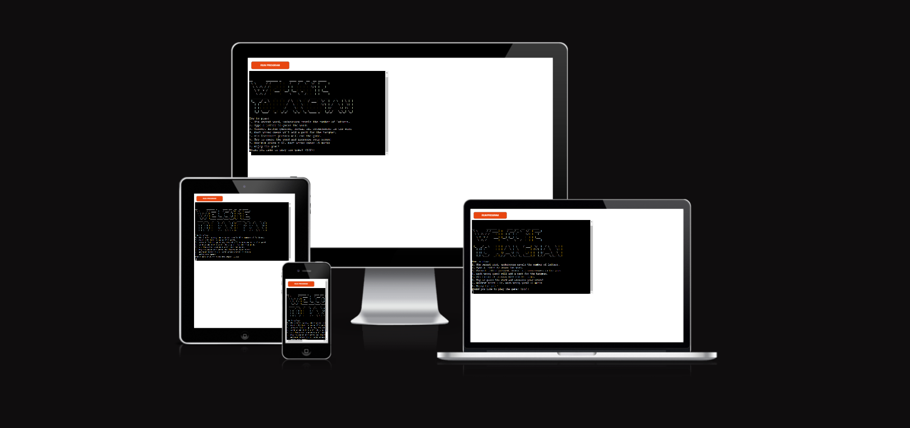

### A live demo to the website can be found [here](https://portfolio-project3-hangman-654eb8cab16a.herokuapp.com/)

## How to Play:
- The system will provide a random word, reflecting the number of letters of the word by dash marks.
- Click on the letter buttons to guess the word.
- If the guessed letter is correct, the system will reveal all occurrences of that letter in the word.
- Each wrong guess will add a part for the hangman.
- Six incorrect guesses will end the game. 
- Try to guess the word and increase your score!

## Planning Phase
### User stories:
- As a player, I want to start a new game so that I can begin guessing a new word.
- As a player, I want to see the number of letters in the word represented by dashes, so that I know how many letters I need to guess.
- As a player, I want to be able to guess a letter and see if it is in the word, so that I can progress in solving the puzzle.
- As a player, I want a visual representation of the Hangman figure to track my progress and avoid making too many incorrect guesses.
- As a player, I want to see the letters I have already guessed, so that I don't accidentally repeat guesses.
- As a player, I want the option to quit the game and start a new one at any time.
- As a player, I want to be notified when I win the game by correctly guessing the word.
- As a player, I want to be notified when I lose the game by making too many incorrect guesses.
- As a player, I want a variety of words to guess to keep the game interesting and challenging.
- As a player, I want to be able to see my score or progress in the game.
- As a player, I want the game to be visually appealing and user-friendly.
- As a player, I want to play an enjoyable game of the classic hangman game by myself.

### Site Aims:
1. Entertainment:
  - Provide a fun and engaging experience for users who enjoy playing word games.
  - Offer a casual and entertaining way for users to spend their leisure time.
2. Education:
  - Reinforce vocabulary and spelling skills by incorporating a variety of words for players to guess.
3. User Engagement:
  - Encourage users to return by providing a user-friendly and enjoyable game environment.
4. Learning and Improvement:
  - Offer a positive learning experience by providing feedback on correct and incorrect guesses.
  - Motivate players to improve their word-guessing skills over time.

### How Will This Be Achieved:
1. Entertainment:
  - Diverse Word Database: Include a wide range of words from different categories to keep the game interesting.
  - Engaging User Interface: Design an attractive and intuitive interface to enhance the overall gaming experience.
2. Education:
  - Word Categories: Categorize words based on difficulty levels or themes (e.g., science, geography, history) to cater to different learning objectives.
  - Progress Tracking: Allow players to track their progress in terms of the words they have successfully guessed, promoting a sense of accomplishment.
3. User Engagement:
  - Regular Updates: Keep the game content fresh by regularly updating the word database, introducing new features, or hosting events.
4. Learning and Improvement:
  - Feedback Mechanism: Provide immediate feedback on each guessed letter, indicating whether it is correct or incorrect.
  - Score Tracking: Implement a scoring system to track and display players' scores, encouraging healthy competition.
5. Motivation for Improvement:
  - Achievements and Rewards: Introduce achievements or rewards for reaching milestones, encouraging players to strive for continuous improvement.
6. Accessibility:
  - User-Friendly Controls: Design intuitive controls and interfaces to make the game accessible to users of all ages and skill levels.

### Game Flow Chart:
To understand the steps required in order to program the game, I created the below flowchart using lucid charts.
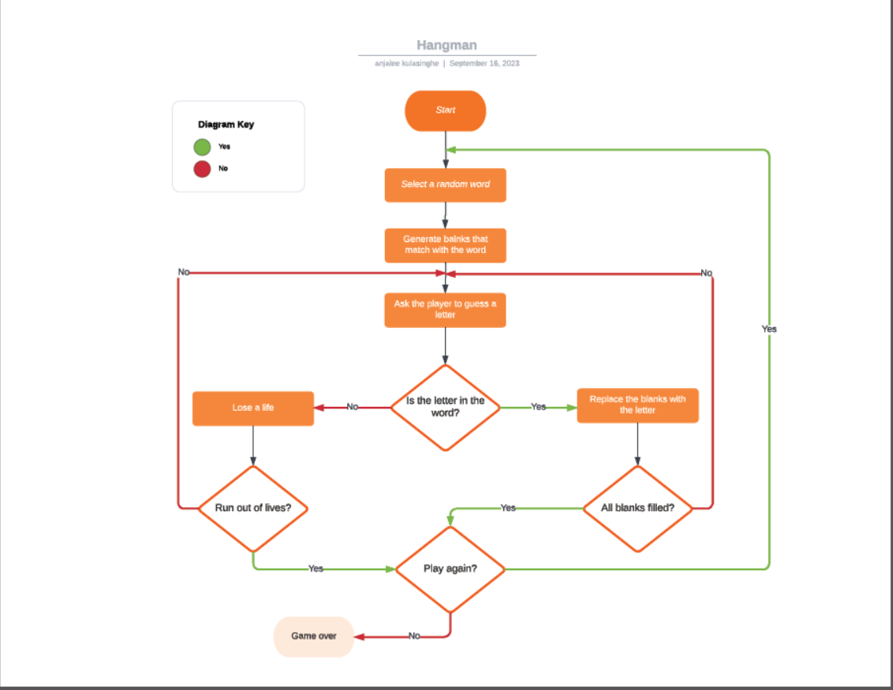

## Features
### Welcome Screen:
From the welcome screen, the user will get the guidance 'How to Play the Game'.
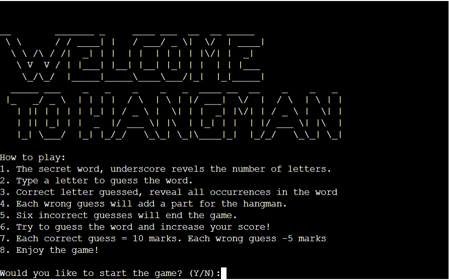

### Once Play Game is Started:
* The player can see the dash lines for the secret word.
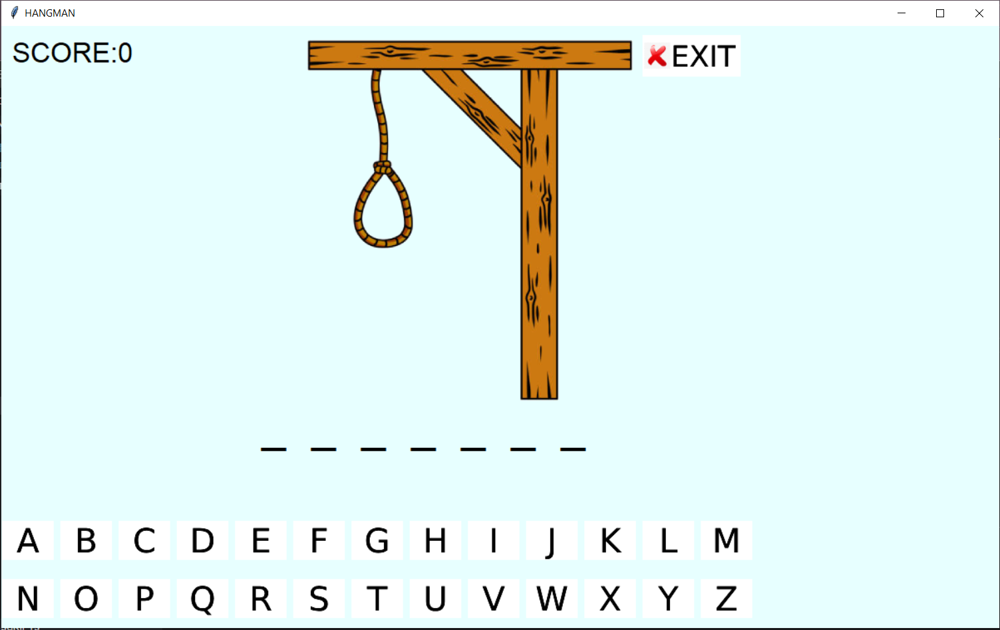
 
* If the player guesses the letter correctly, it will replace the dash line.

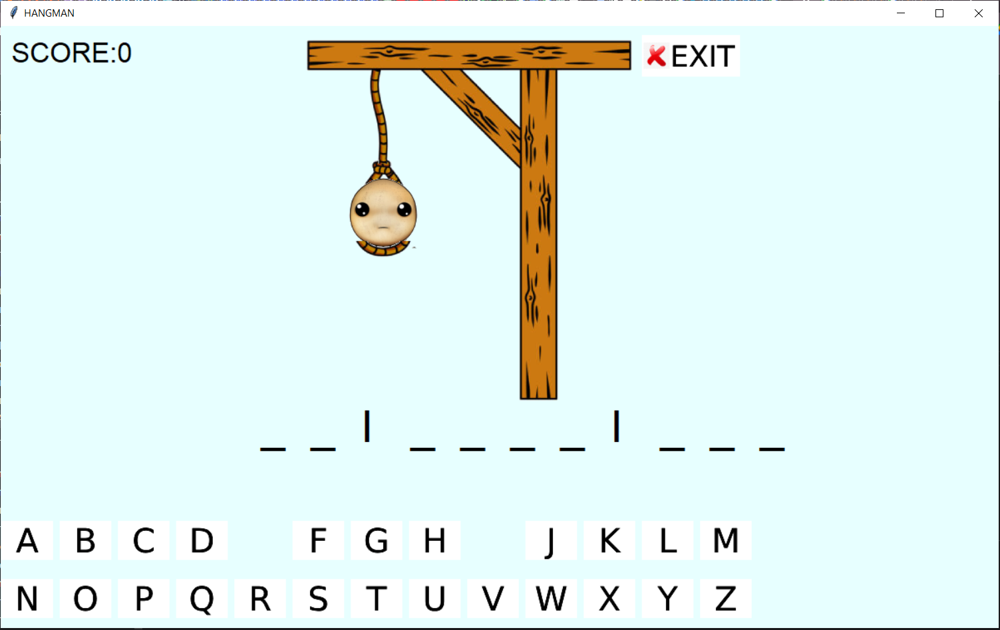

* If the player guesses the wrong letter, it will start to draw the hangman.
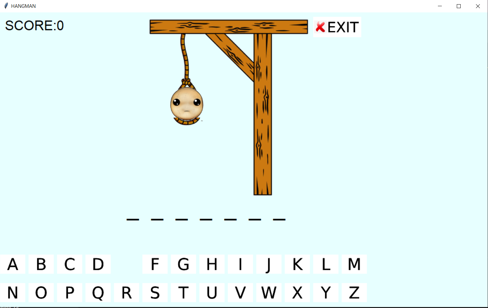

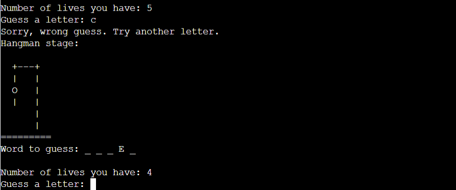

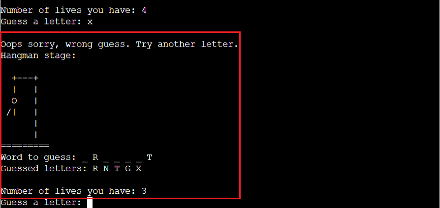

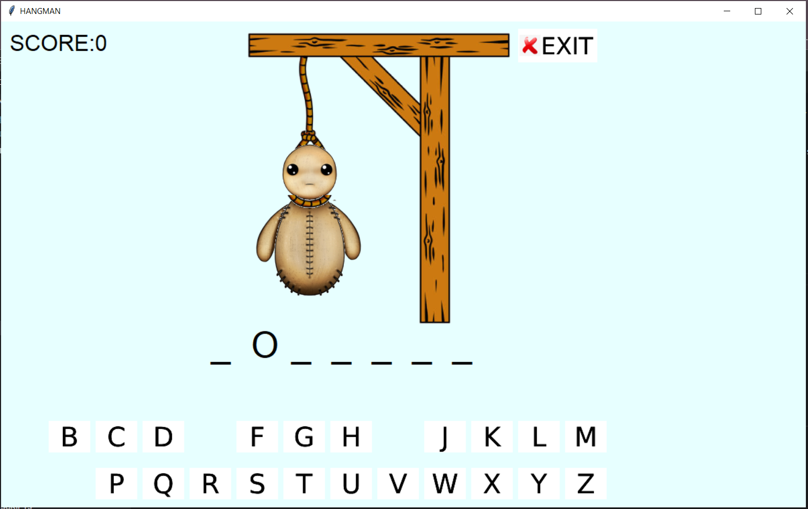

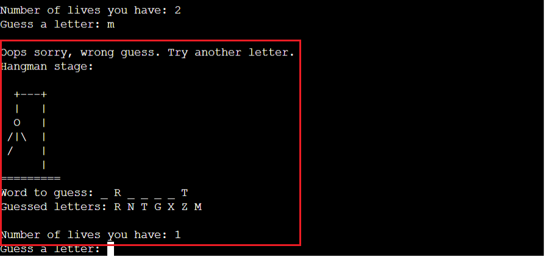

* If the player guesses wrong six times, the hangman will be completed, and the player will lose the game.
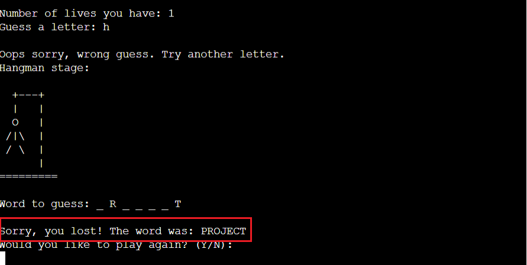

* If the player guesses the word correctly, the player will win the game.
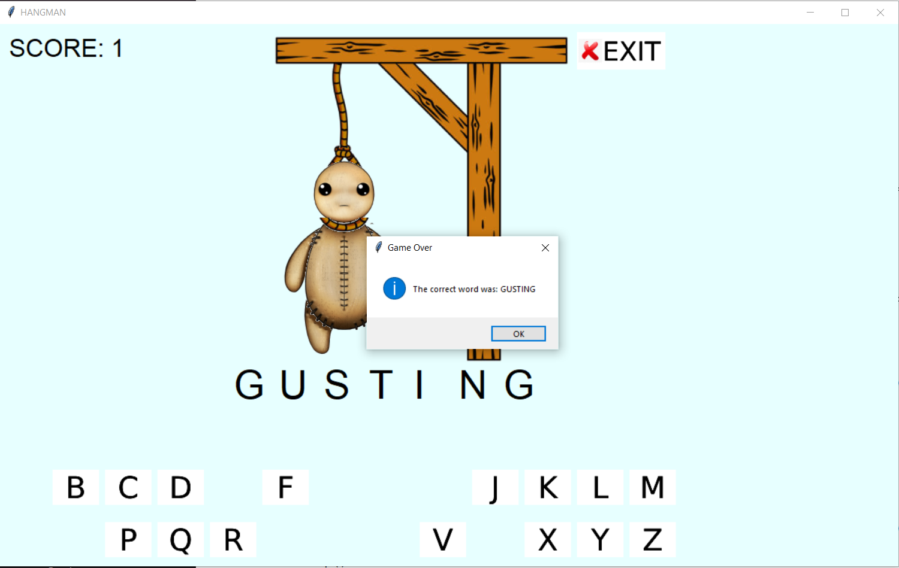

* If the player wins the game, a score will be added.
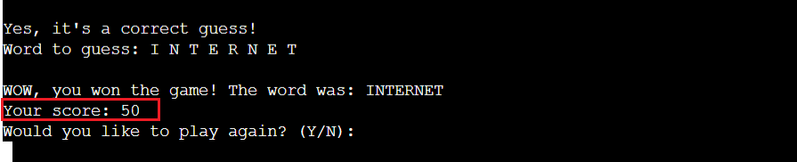

* Whether the player wins or loses the game, the player has the option to continue the game.
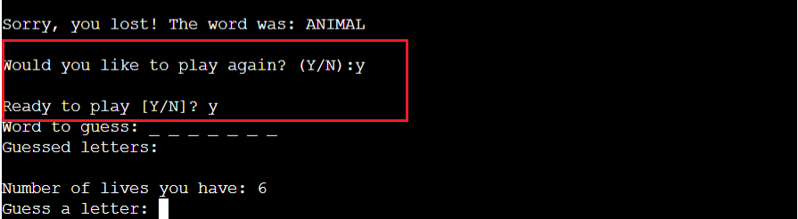

* If the player wants, the player has a chance to exit the game.
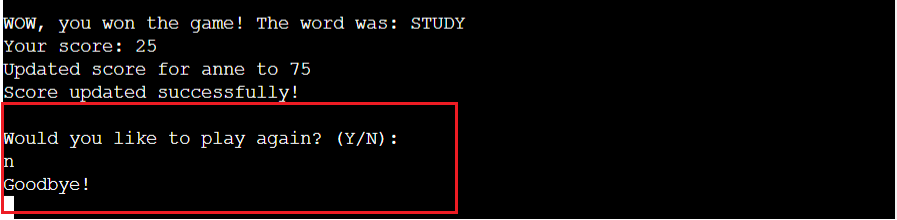

### Error Handling:
During the development process, error handling is done to make sure the player will have a smoother user experience and to make the code more robust.
1. File Not Found:
  - If the 'words.txt' file is not found, the code prints an error message and exits the program.
2. File Reading Error:
  - If there is an error while reading the file, an exception is caught, and an error message is printed before exiting.
3. Resource Loading Error:
  - If there is an error while loading image resources (hangman images), an exception is caught, and an error message is printed before exiting.
4. Tkinter Window Creation Error:
  - If there is an error during the creation of the Tkinter window, an exception is caught, and an error message is printed before exiting.

### Future-Enhancements:
Below are the things that would take my current MVP to the next level:
1. Multiple Difficulty Levels:
    - Implement different difficulty levels with varying word complexities. Allow users to choose their preferred difficulty before starting the game.
2. Word Categories:
   - Introduce word categories or themes (e.g., animals, countries, sports) and allow users to select a category before playing.
3. User Profiles:
   - Implement user profiles to track individual scores and progress over time. Users can log in and see their game history.
4. Hint System:
   - Add a hint system that provides players with a clue about the selected word. This can be optional and may cost the player in terms of points.
5. Multiplayer Mode:
   - Develop a multiplayer mode where users can play against each other. This could involve taking turns guessing words or competing in real-time.
6. Achievements and Badges:
   - Introduce achievements or badges for completing specific challenges, reaching high scores, or mastering certain categories.
7. Customizable Hangman Images:
   - Allow users to choose from a selection of hangman images or upload their own custom images to personalize the game.
8. Sound Effects and Music:
   - Incorporate sound effects for correct and incorrect guesses, as well as background music to enhance the gaming experience.
9. Leaderboards:
   - Create online leaderboards to showcase top scores globally or within specific categories. This encourages friendly competition among players.
10. Responsive Design:
   - Ensure the game is fully responsive to different screen sizes, making it accessible and enjoyable on various devices.

## Data Model
The data model revolves around maintaining the state of the game, handling user input, updating the graphical interface, and managing resources. The code combines Tkinter GUI elements, game logic, and file operations to create a simple Hangman game.

### Overview
The breakdown of the data model is as follows:
* Game State Variables:
  * **score:** An integer representing the player's score.
  * **run:** A boolean indicating whether the game is currently running.
  * **show_welcome_message:** A boolean variable to track whether to show the welcome message.

* Tkinter Window and GUI Elements:
  * **root:** The Tkinter main window that serves as the container for all GUI elements.
  * **buttons:** A list to store Tkinter Button widgets representing letter buttons.
  * **dashes_labels:** A list to store Tkinter Label widgets representing the dashes for the letters in the word.
  * **hangman_label:** A Tkinter Label widget displaying the hangman image.
  * **score_label:** A Tkinter Label widget displaying the player's score.

* Hangman-related Variables:
  * **count:** An integer representing the count of incorrect guesses (used to determine which hangman image to display).
  * **win_count:** An integer representing the count of correct guesses.
  * **selected_word:** A string representing the randomly chosen word for the current game.

* Game Functions:
  * **welcome_message():** Displays a welcome message using a Tkinter messagebox.
  * **check(letter, button_idx):** Handles player clicks on letter buttons, updates game state based on guesses, and checks for win/loss conditions.
  * **update_hangman():** Updates the displayed hangman image based on the count of incorrect guesses.
  * **close():** Handles the exit button, prompting the user with a confirmation message before exiting.

* Main Loop and Game Initialization:
  * A while loop (**while run:**) that controls the flow of the game.
  * The loop initializes a Tkinter window (root) and sets up the game elements.
  * The loop continues as long as the **run** variable is **True**.

* Resource Loading:
  * Images for letters, hangman stages, and an exit button are loaded using the Tkinter **PhotoImage** class and stored in relevant dictionaries or lists (**image_dict**, **hangman_images**).

* File Handling:
  * The code attempts to open and read from a file named 'words.txt' to obtain a list of words for the game. It handles potential errors like file not found or reading errors.

*Error Handling:
  * There are some basic error-handling mechanisms, such as handling file-related errors and general exceptions during Tkinter window creation.

### Logic Flow:
 The logic flow involves the continuous execution of the main loop, where the Tkinter window is created, user input is handled, and the game state is updated based on correct or incorrect guesses. The loop continues until the player decides to exit the game.

## Testing Phase

## Libraries
### random:
This library is used for generating random numbers. In the code, it is used to select a random index for choosing a word from the list.

### tkinter:
Tkinter is the standard GUI (Graphical User Interface) toolkit for Python. It is used to create the main game window, labels, buttons, and message boxes.

### os:
OS is used to handle file paths when loading image resources.

## Deployment
### Playing on a Local machine:
### Final Deployment to Heroku:

## Credits
### Content
* The word list was taken from [BrandonKirklen](https://github.com/Tom25/Hangman/blob/master/wordlist.txt).
* The code idea to do the project using tkinter GUI is taken from [CodeSploit](https://www.youtube.com/watch?v=99zOhml1-6s).
* The help for some error handling was taken from [BrandonKirklen](https://github.com/Tom25/Hangman/blob/master/hangman.py).

### Media
* The Rag dall image used as the hangman was taken from the artist [Fernanda Mello](https://fehcm.artstation.com/projects/L3EVOR).
* All images used in the project was created using [Photopea](https://www.photopea.com/) online editor.

### Acknowledgements
* Inspirational support from [Jenny's Lectures CS IT](https://www.youtube.com/watch?v=tMJbCWHAWQ4)
* Took the support from [Open Source Options](https://www.youtube.com/watch?v=D7zfEZGbu5A) to learn Run Python Scripts from the Local Terminal.

* The the Code Institute Tutor Assistance for helping me with the correct guidance.
* Last but not least, my mentor, Medale Oluwafemi, for his invaluable guidance.