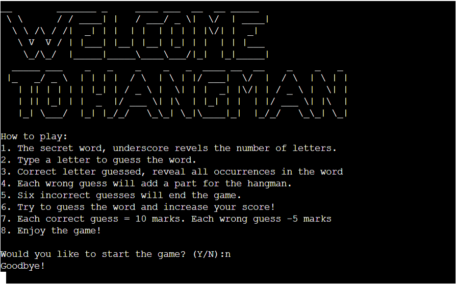
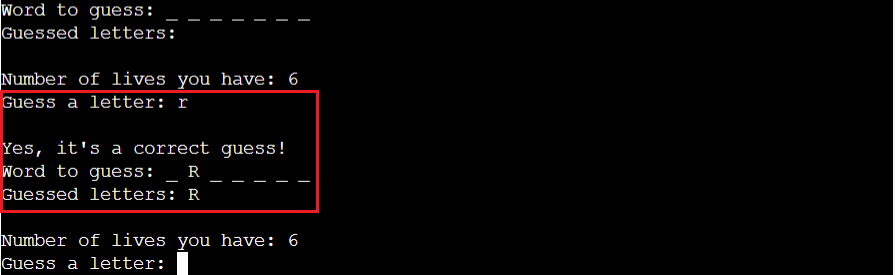
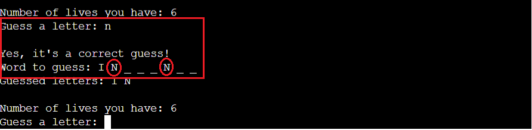
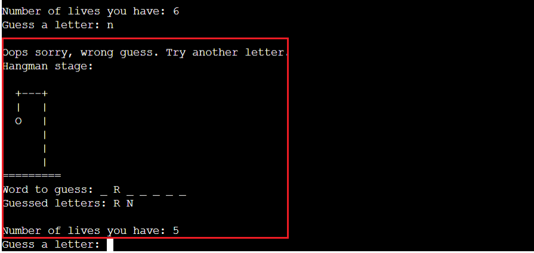
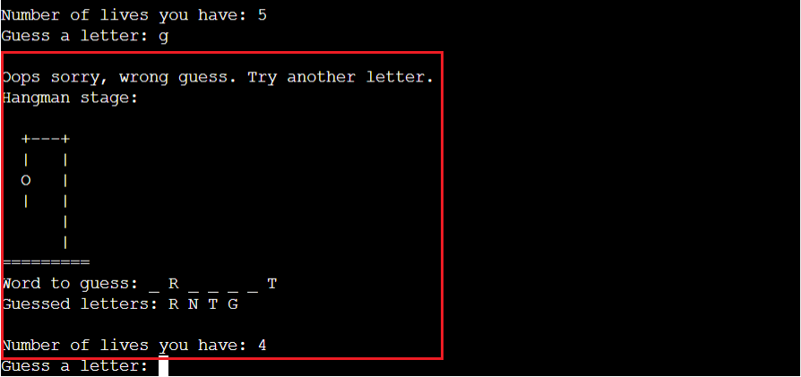
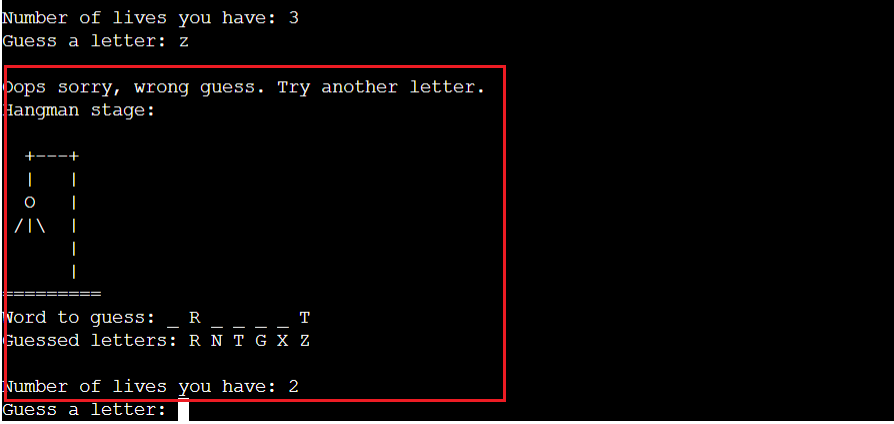
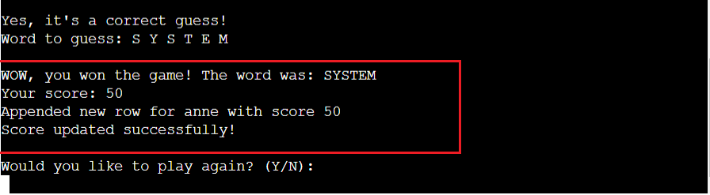
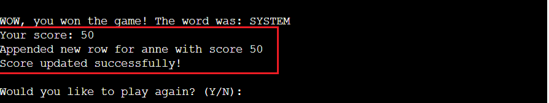
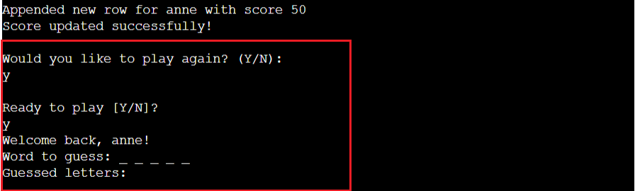
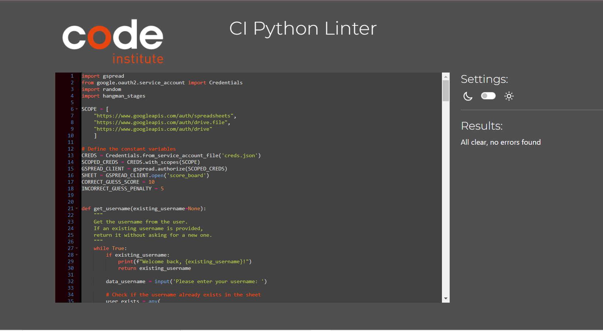

# Hangman

## Code Institute - Thired Milestone Project: Python Essentials Portfolio Project

## Overview
This program is a computerized version of the original hangman game, based inside a mock terminal deployed via Heroku.

As a child, I enjoyed the Hangman game a lot during my school days. It is popular as an educational tool to reinforce vocabulary and spelling skills.

Hangman is a classic word-guessing game in which one player thinks of a word and the other player tries to guess it by suggesting letters. The word is represented by dashes, with each dash representing a letter in the word. The player guessing the word suggests letters one at a time, and if the guessed letter is in the word, the other player reveals all occurrences of that letter in the word. If the guessed letter is not in the word, a part of a stick figure (traditionally a gallows) is drawn as a tally of incorrect guesses.

The game continues until the guessing player successfully guesses the word or the stick figure is completely drawn (indicating too many incorrect guesses), resulting in a loss. The stick figure drawing often resembles a hanging person, which is why the game is called "Hangman."

# Table of Contents
- [Demo](#demo)
  - [A live demo to the website can be found here](#a-live-demo-to-the-website-can-be-found-here)
- [Planning Phase](#planning-phase)
  - [User stories](#user-stories)
  - [Site Aims](#site-aims)
  - [How Will This Be Achieved](#how-will-this-be-achieved)
  - [Game Flow Chart](#game-flow-chart)
- [Features](#features)
  - [Welcome Screen](#welcome-screen)
  - [Once Play Game is Started](#once-play-game-is-started)
  - [Error Handling](#error-handling)
  - [Future-Enhancements](#future-enhancements)
- [Data Model](#data-model)
- [Testing](#testing)
  - [Solved Bugs](#solved-bugs)
  - [Remaining Bugs](#remaining-bugs)
  - [Validator Testing](#validator-testing)
- [Libraries](#libraries)
  - [gspread](#gspread)
  - [google.oauth2.service_account](#googleoauth2service_account)
  - [random](#random)
- [Deployment](#deployment)
    - [Final Deployment to Heroku](#final-deployment-to-heroku)
- [Credits](#credits)
  - [Content](#content)
  - [Acknowledgements](#acknowledgements)

## Demo

### A live demo to the website can be found [here](https://portfolio-project3-hangman-654eb8cab16a.herokuapp.com/)

## Planning Phase
### User stories
- As a player, I want to start a new game so that I can begin guessing a new word.
- As a player, I want to see the number of letters in the word represented by dashes so that I know how many letters I need to guess.
- As a player, I want to be able to guess a letter and see if it is in the word, so that I can progress in solving the puzzle.
- As a player, I want a visual representation of the Hangman figure to track my progress and avoid making too many incorrect guesses.
- As a player, I want to see the letters I have already guessed so that I will not repeat the same letter.
- As a player, I want to be notified when I win the game by correctly guessing the word.
- As a player, I want to be notified when I lose the game by making too many incorrect guesses.
- As a player, I want a variety of words to guess to keep the game interesting and challenging.
- As a player, I want to be able to see my score or progress in the game.
- As a player, I want to continue or exit the game.
- As a player, I want the game to be visually appealing and user-friendly.
- As a player, I want to play an enjoyable game of the classic hangman game by myself.

### Site Aims
1. Entertainment:
  - Provide a fun and engaging experience for player who enjoy playing word games.
  - Offer a casual and entertaining way for the player to spend their leisure time.
2. Education:
  - Emphasize vocabulary and spelling skills by including a variety of words for players to guess.
3. Player Engagement:
  - Encourage the player to return by providing a simple, easy to understand game environment.
4. Learning and Improvement:
  - Offer a positive learning experience by providing feedback on correct and incorrect guesses.
  - Motivate players to improve their word-guessing skills over time.

### How Will This Be Achieved
1. Entertainment:
  - Diverse Word Database: Include a wide range of words from different categories to keep the game interesting.
  - Engaging User Interface: Design a simple interface to increase the overall gaming experience.
2. Education:
  - Word Categories: Categorize words based on difficulty levels or themes (e.g., science, geography, history) to cater to different learning objectives.
  - Progress Tracking: Allow players to track their progress in terms of the words they have successfully guessed, promoting a sense of accomplishment.
3. Player Engagement:
  - Regular Updates: Keep the game content fresh by regularly updating the word database, introducing new features, or hosting events.
4. Learning and Improvement:
  - Feedback Mechanism: Provide immediate feedback on each guessed letter, indicating whether it is correct or incorrect.
  - Score Tracking: Implement a scoring system to track and display players' scores.
5. Motivation for Improvement:
  - Achievements and Rewards: Introduce achievements or rewards for reaching milestones, encouraging players to strive for continuous improvement.
6. Accessibility:
  - User-Friendly Controls: Implement natural commands, to ensure the game is easily accessible for players of various ages and skill levels.

### Game Flow Chart
To understand the steps required in order to program the game, I created the below flowchart using lucid charts.

## Features
### Welcome Screen
From the welcome screen, the player will get the guidance 'How to Play the Game'.

Then the system will confirm whether the player wants to play the game and is ready to start.
The player can exit the game by typing 'N'.

If the player decided to play the game, player will asked to enter a username.

If the player is a old player, it will check with the google sheet and welcome the old player

Google sheet

### Once Play Game is Started
* The player can see the dash lines for the secret word.
  

* If the player guesses the letter correctly, it will replace the dash line.
  

  

* If the player guesses the wrong letter, it will start to draw the hangman.

  

  

  

  

* If the player guesses wrong six times, the hangman will be completed, and the player will lose the game.

* If the player guesses the word correctly, the player will win the game.

* If the player wins the game, a score will be added and the score and username will be added to the Google Sheet.

After playing the second round score will update (old score + new score)

  If it is a old player same way the score will update and new score will display
  

  Google sheet - adding a new player

  

  Google sheet - updating a old player

  

* Whether the player wins or loses the game, the player has the option to continue the game.

  If the player decides to continue the game, the player will be welcome back to the game.
  

* If the player wants, the player has a chance to exit the game.

### Error Handling
During the development process, error handling is done to make sure the player will have a smoother experience and to make the code more robust.
When developing the code error handling is implemented using try-except blocks.
* File Not Found:
  - If the 'words.txt' file is not found, the code prints an error message and exits the program.
* Error handling is focused on capturing exceptions. This was very useful when external services (like Google Sheets) or file operations are used.

### Future-Enhancements
Below are the things that would take my current MVP to the next level:
1. Multiple Difficulty Levels:
    - Implement different difficulty levels with varying word complexities. Allow player to choose their preferred difficulty before starting the game.
2. Word Categories:
   - Introduce word categories or themes (e.g., animals, countries, sports) and allow player to select a category before playing.
3. User Profiles:
   - Implement user profiles to track individual scores and progress over time. Player can log in and see their game history.
4. Hint System:
   - Add a hint system that provides players with a clue about the selected word. This can be optional and may cost the player in terms of points.
5. Multiplayer Mode:
   - Develop a multiplayer mode where players can play against each other. This could involve taking turns guessing words or competing in real-time.
6. Achievements and Badges:
   - Introduce achievements or badges for completing specific challenges, reaching high scores, or mastering certain categories.
7. Sound Effects and Music:
   - Incorporate sound effects for correct and incorrect guesses, as well as background music to enhance the gaming experience.
8. Leaderboards:
   - Create online leaderboards to showcase top scores globally or within specific categories. This encourages friendly competition among players.
9. User Interface:
   - Design an attractive and intuitive interface to enhance the overall gaming experience.

## Data Model
This is a text-based Hangman game.

### Overview of Functions
The breakdown of the data model is as follows:
1. **get_username():**
  - Gets the username from the user.
  - If the username is an existing one, returns it without asking for a new one.
2. **get_sheet_data():**
  - Retrieves data from the 'score_board' google sheet.
  - Each entry in the data includes the username, score, and index.
3. **update_scoreboard():**
  - Updates the 'score_board' sheet with the username and score.
  - If the username already exists, adds the new score to the old score.
4. **choose_word():**
  - Reads a list of words from a text file ("words.txt").
  - Randomly selects one word and converts it to uppercase.
5. **initialize_display():**
  - Initializes the display by creating a list of underscores that are equal to the letters of the word.
6. **is_valid_input():**
  - Checks if the inputted guessed letter is a valid single alphabet letter.
7. **print_welcome():**
  - Displays a welcome message and instructions on how to play the game.
8. **calculate_score():**
  - Calculates the player's score based on the number of correct and incorrect guesses.
9. **execute_hangman_game():**
  - Handles the execution of the hangman game.
  - Displays the welcome message and cue the player to start.
  - Manages multiple rounds of the game, updating the scoreboard after each round.
10. **get_ready_status():**
  - Checks if the player is ready to play the game.
11. **play_game():**
  - Plays the Hangman game, allowing the player to guess words.
  - Displays the word to guess, handles turns, updates the scoreboard, and decide the game outcome.
12. **play_turn():**
  - Plays a single turn of the Hangman game.
  - Gets the letter guessed by the player, updates the display, and manages incorrect guesses.
13. **get_guessed_letter():**
  - Gets a letter guessed by the player and converts it to uppercase.
14. **update_display():**
  - Updates the display by replacing the underscore with the letter based on the guessed letter in the chosen word.

### Logic Flow
 The logic flow involves the continuous execution of the game, where user input is handled, and the game state is updated based on correct or incorrect guesses. The loop continues until the player decides to exit the game.

## Testing
I have manually tested this project by doing the following:
1. Tested in my local terminal and the Code Institute Heroku terminal.
2. Give invalid inputs: to check whether it only considers alphabetic letters and not to lose a life when a number, a special character, or a space is given.
3. PEP8: Passed the code through PEP8 linter and confirmed there are no problems.

**Solved Bugs**

  - Ready to play [Y/N]? when the player type 'N', Still start the game - to fix this, I add
  `if start_game != 'Y':`
        `print("Goodbye!")`
        `return`
  - Not to repeat the welcome message if the player decides to continue playing, I modify the `if play_again_input == 'Y':` by changing it as
   `if play_again_input != 'Y':`
            `print("Goodbye!")`
            `return`
        `else:`
            `start_game = None`
  - Accept the invalid input when the player starts the game. To fix this issue, I used a while loop to check whether the player has included a character other than 'Y' or 'N'.
   `while True:`
        `user_input = input("\nReady to play [Y/N]? ").upper()`
        `if user_input == "Y" or user_input == "N":`
            `break'
        `else:`
            `print("Invalid entry. Please enter 'Y' or 'N'.")`
  - Not exit the game when the player selects 'N' - to fix this, use the `break` command.
  - Player needs to answer two times to the question, 'Would you like to play again?' at the end if the player wants to exit. To fix this issue, I removed asking that question from the **play_game():** function and handled the exit part only from the **execute_hangman_game():**. Earlier, I used the `break` in the exit the game loop. I replace it with `return`.
  - While running the program, I found that there is a syntax SyntaxWarning for hangman stages (**hangman_stages.py:1: SyntaxWarning: invalid escape sequence '\ '**). To make sure the backslashes won't be treated as escape characters, I used the **r** prefix.
  - While running the program, I found that the Ascii hangman stages were appearing in the incorrect order. To fix it, I changed the Ascii figure order in the hangman_stages.py file.
  - When using the validator, I found the issue **W291 trailing whitespace** in the welcome ascii art. To fix the issue, I have removed the trailing whitespace at the end.
  - When I connet the programe with the Google sheet, new username did not record in the Google sheet. Only the score is recorded. To fix this in **get_username**function pass the variable `existing_username=None` and update the **execute_hangman_game** function accordingly.

**Remaining Bugs**
  - No bugs are remaining

**Validator Testing**
  - PEP8 - No errors were returned from https://pep8ci.herokuapp.com/

## Libraries
### gspread
Used for interacting with Google Sheets.
### google.oauth2.service_account
Specifically, the Credentials module from this library is used to handle authentication with Google Sheets using a service account file (creds.json).
### random
This library is used for generating random numbers. In the code, it is used to select a random index for choosing a word from the list.

The Python file called **hangman_stages** is treated as a custom module that contains ASCII art representations of the hangman stages.

## Deployment

### Final Deployment to Heroku
This project was deployed using Code Institue's mock terminal for Heroku.
Steps of deployment:
  - Clone the repository.
  - Create a new Heroku app.
  - Set the buildbacks to `Python` and `NodeJS` in order.
  - Link the Heroku app to the GitHub repository.
  - Click on Deploy.

## Credits
### Content
* ASCII hangman art was taken from [
chrishorton](https://gist.github.com/chrishorton/8510732aa9a80a03c829b09f12e20d9c).
* The help for some error handling was taken from [BrandonKirklen](https://github.com/Tom25/Hangman/blob/master/hangman.py).
* Welcome ASCII art was generated from [Seotoolbelt](https://seotoolbelt.co/tools/ascii-art-generator/#csv-tab)
* Steps of deployment for readme file was take from the Code Institute's [Sample README.md](https://learn.codeinstitute.net/courses/course-v1:CodeInstitute+PE_PAGPPF+2021_Q2/courseware/b3378fc1159e43e3b70916fdefdfae51/605f34e006594dc4ae19f5e60ec75e2e/).

### Acknowledgements
* To do the connection with external services (Google Sheets) got the inspirational support from Code Institute's [Love Sandwiches - Essentials Project](https://learn.codeinstitute.net/courses/course-v1:CodeInstitute+LS101+2021_T1/courseware/293ee9d8ff3542d3b877137ed81b9a5b/58d3e90f9a2043908c62f31e51c15deb/)
* Inspirational support from [Jenny's Lectures CS IT](https://www.youtube.com/watch?v=tMJbCWHAWQ4)
* Took the support from [Open Source Options](https://www.youtube.com/watch?v=D7zfEZGbu5A) to learn Run Python Scripts from the Local Terminal.
* Grammatical and spelling checks were done using [QuillBot](https://quillbot.com/grammar-check).
* Last but not least, my mentor, Medale Oluwafemi, for his invaluable guidance.